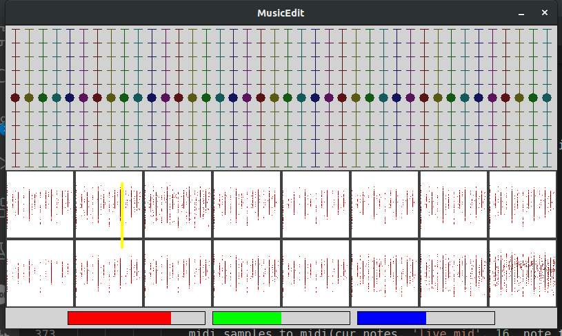

# Music_generator
NN music generator

## Install dependencies
`pip install -r requirements.txt`

## To train the model
1. Create a directory called songs in your workspace and place midi files inside them
2.  Use this command to initiate training   
`python train.py`

## To play songs
`python song_editor.py`

